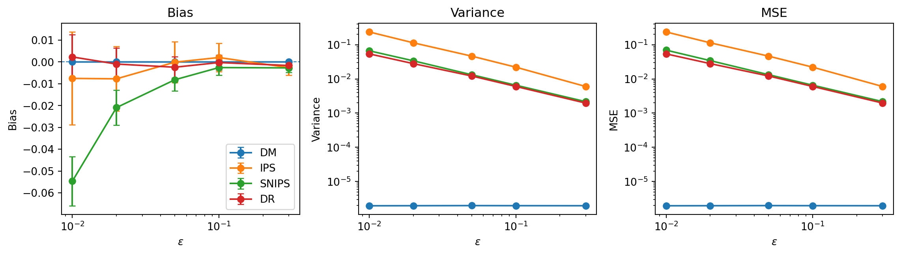

# Contextual Bandits OPE Lab

**[Read the full report](https://nfuent02.github.io/bandit-ope-lab/)** ·
**[PDF](docs/report_en.pdf)** ·
**[Spanish version](https://nfuent02.github.io/bandit-ope-lab/report_es.html)**

An empirical study of **off-policy evaluation (OPE)** in contextual bandits, focused on understanding when and why four classical estimators succeed or fail:

- Direct Method (DM)
- Inverse Propensity Scoring (IPS)
- Self-Normalized IPS (SNIPS)
- Doubly Robust (DR)

The project uses a controlled synthetic environment in which the true policy value is known exactly, allowing Monte Carlo behavior to be compared against theoretical bias, variance, and mean squared error.

## Questions studied

> **When and why do DM, IPS, SNIPS, and DR fail** at estimating the value of a target policy in contextual bandits, as a function of nuisance-model specification, policy overlap, policy shift, and positivity?

The experiments isolate four failure mechanisms:

1. **Weak overlap:** what happens as logging propensities become small?
2. **Nuisance-model misspecification:** how do errors in the reward and propensity models affect DM, IPS, SNIPS, and DR?
3. **Positivity violation:** what changes when the target policy assigns probability to actions that are never observed under the logging policy?
4. **Policy shift:** what happens as the target policy moves progressively away from a fixed logging policy?

## Experimental design

All experiments run on a small, fully known synthetic DGP (2 contexts, 2 actions, Bernoulli rewards), so the true policy value is available in closed form and can be compared against estimator behavior. Studies A, B, and D use $R=2000$ Monte Carlo replications of sample size $n=200$. Study C instead uses a single logged sample compatible with two observationally equivalent reward models to demonstrate non-identification under positivity failure. Across studies, one failure mechanism is varied at a time while the rest of the DGP is controlled.

## Main findings

- **Weak overlap is primarily a variance problem as long as positivity still holds.**  
Importance-weighted estimators become unstable as probability ratios grow.

- **Misspecification affects the estimators differently.**
DM relies on the reward model, IPS and SNIPS rely on logging propensities, while DR retains its double-robustness guarantee when at least one nuisance model is correctly specified.

- **Positivity failure is qualitatively different from weak overlap.**
The target policy value can cease to be identified from the observable logged-data distribution.

- **Policy shift increases importance-weight dispersion even when the logging policy and its support remain fixed**, which can substantially increase the variance of weighting-based estimators.

- **No estimator dominates universally.**
Their behavior reflects different trade-offs between modeling assumptions, importance weighting, bias, and variance.




*Study A: deteriorating overlap sharply increases the variance and MSE of importance-weighted estimators, while oracle DM remains stable.*

## Report

The full analysis, including theoretical derivations, Monte Carlo experiments,
figures, and interpretation, is available here:

- **English:** [HTML](https://nfuent02.github.io/bandit-ope-lab/) · [PDF](docs/report_en.pdf)
- **Spanish:** [HTML](https://nfuent02.github.io/bandit-ope-lab/report_es.html) · [PDF](docs/report_es.pdf)

## Repository structure

```text
ope/            Core DGP, estimators, theory, metrics, and nuisance models
experiments/    Validation and Monte Carlo study scripts
results/        Generated numerical results (CSV)
tests/          Automated sanity and regression tests
docs/           Quarto sources, rendered reports, and bibliography
```

## Reproducing the project

### Requirements

- Python 3.14.2
- [Quarto](https://quarto.org/)
- A LaTeX distribution (e.g. TinyTeX) for PDF rendering

Create and activate a virtual environment, then install the Python dependencies and the local package:

```bash
python -m venv .venv
source .venv/Scripts/activate   # Git Bash on Windows

python -m pip install -r requirements.txt
python -m pip install -e .
```

Run the automated tests:

```bash
python -m pytest
```

Validate the synthetic data-generating process:

```bash
python experiments/00_validate_dgp.py
```

Run the scripts underlying the four main studies:

```bash
# Study A — weak overlap
python experiments/02_overlap.py

# Study B — nuisance-model misspecification
python experiments/03_estimator_comparison.py
python experiments/04_double_robustness_grid.py

# Study C — positivity violation
python experiments/06_positivity_violation.py

# Study D — policy shift
python experiments/07_policy_shift.py
```

The English and Spanish reports can then be rendered with Quarto:

```bash
quarto render docs/report_en.qmd
quarto render docs/report_es.qmd
```